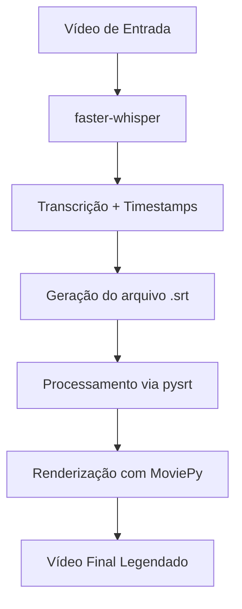

# 🎬 Automatic Video Subtitler

## 🎯 Objetivo
Desenvolver uma aplicação capaz de transformar automaticamente a fala de um vídeo em legendas através de um **único** comando no Terminal, reduzindo o trabalho manual de transcrição e edição.


## 🚀 Tecnologias Utilizadas

- [Python 3.14](https://www.python.org)
- [Whisper (faster-whisper)](https://pypi.org/project/faster-whisper/)
- [MoviePy](https://pypi.org/project/moviepy/)
- [FFmpeg](https://www.ffmpeg.org)

---

## ⚙️ Resultado

- **Execução** através de um **único comando** no Terminal.
- **Transcrição automática** do áudio do vídeo com `Whisper`, identificando o exato momento em que cada palavra é falada.
- **Geração automática** de arquivo `.srt` (*legenda*), com divisão adaptativa por pontuação e quantidade de palavras.
- **Renderização** das legendas diretamente no vídeo (com texto centralizado e contorno para facilitar a leitura) e **exportação final** utilizando `MoviePy` e `FFmpeg`.

---

## 📦 Instalação

### 1. Clone o repositório e acesse a pasta

```bash
git clone https://github.com/IsacFreitaas/python-automatic-video-subtitler.git

cd python-automatic-video-subtitler
```

### 2. Crie e ative o ambiente virtual

```bash
# Criar o ambiente virtual
python3 -m venv venv

# Ativar no Linux / macOS:
source venv/bin/activate

# Ativar no Windows (PowerShell):
.\venv\Scripts\Activate.ps1

# Ativar no Windows (CMD):
.\venv\Scripts\activate.bat

```

> 💡 *Dúvidas com ambientes virtuais? Assista a esse meu [tutorial sobre venv](https://youtu.be/kyiLBafjpMQ).*

### 3. Instale as dependências Python

```bash
pip install -r requirements.txt
```

---

### 🛠️ Pré-requisito: FFmpeg

O **FFmpeg** é necessário para o processamento de áudio e vídeo. Ele deve estar instalado e disponível no `PATH` do sistema.

#### **Linux (Ubuntu/Debian):**

```bash
sudo apt update && sudo apt install ffmpeg
```

#### **macOS (via Homebrew):**

```bash
brew install ffmpeg
```

#### **Windows:**

Você pode instalar facilmente via terminal usando o `winget`:

```cmd
winget install ffmpeg
```

*(Caso prefira a instalação manual, baixe os binários em [ffmpeg.org](https://www.ffmpeg.org) e adicione a pasta `bin` às Variáveis de Ambiente do sistema).*

---

## 🧠 Como Usar

Com o ambiente virtual ativo, execute o script passando o caminho do vídeo como argumento:

```bash
python main.py /caminho/para/seu_video.mp4
```

### O que o programa fará automaticamente:

1. Carrega o modelo **Whisper** (faster-whisper).
2. Transcreve o áudio do vídeo com **timestamps** no nível de palavras.
3. Gera o arquivo de legenda no formato `.srt`.
4. Divide as legendas em blocos otimizados para leitura.
5. Insere as legendas diretamente sobre o vídeo e renderiza.
6. Exporta o vídeo final (`nome_do_video_legendado.mp4`) no mesmo diretório do arquivo original.

---

## ➡️ Lógica de Divisão das Legendas

Para garantir uma leitura dinâmica e agradável (estilo *Shorts/Reels/TikTok*), o projeto utiliza os timestamps de cada palavra para criar blocos curtos e sincronizados.

Uma nova linha de legenda é gerada quando:

* Atinge o limite máximo de **5 palavras** por bloco.
* Contém pelo menos **3 palavras** e finaliza com pontuação (`,`, `.`, `?` ou `!`).

Isso impede frases longas na tela e mantém a legenda perfeitamente ritmada com a fala.

## ⚙️ Fluxo de Execução



---

## ⚠️ Configuração do Modelo e Performance

Por padrão, o projeto está configurado para utilizar o modelo **medium** rodando em **CPU**:

```python
WhisperModel("medium", device="cpu", compute_type="int8")
```

* **Modelos menores** (`tiny`, `base`, `small`): Mais rápidos, porém menos precisos.
* **Modelos maiores** (`medium`, `large-v2`, `large-v3`): Maior precisão na transcrição, porém exigem mais processamento e memória RAM/VRAM.
* Se você possui uma GPU NVIDIA configurada com CUDA, pode alterar o parâmetro `device="cuda"` no código para acelerar significativamente o processo.

## 🎥 Conteúdo Relacionado a esse projeto e melhorias

Este projeto foi criado como parte de uma série de conteúdos sobre **automação com Python**, demonstrando como substituir tarefas manuais de edição por código. No futuro, posso criar uma interface gráfica para esse programa para atingir um público maior para esse app. Esse é meu objetivo com este pequeno projeto Open-Source.

🎬 **Assista ao vídeo de construção desse projeto no YouTube:** [Clique aqui para assistir](https://youtu.be/va4TGsFv0p0)

---

## 👨🏻‍💻 Sobre mim
<p align="left"> <a href="https://www.youtube.com/@isaczeitgeist">  </a> </img> </p>

### [Isac Freitas](https://www.instagram.com/isaczeitgeist)

**Desenvolvedor Python** | **Backend & Ciência de Dados** | **APIs e Automação**

*Simplificando Python e transformando código em aplicações reais.*

#### ➡️ Me encontre nas redes sociais: [https://inktr.ee/isaczeitgeistpy](https://linktr.ee/isaczeitgeistpy)

---

**Obrigado pela atenção!**
